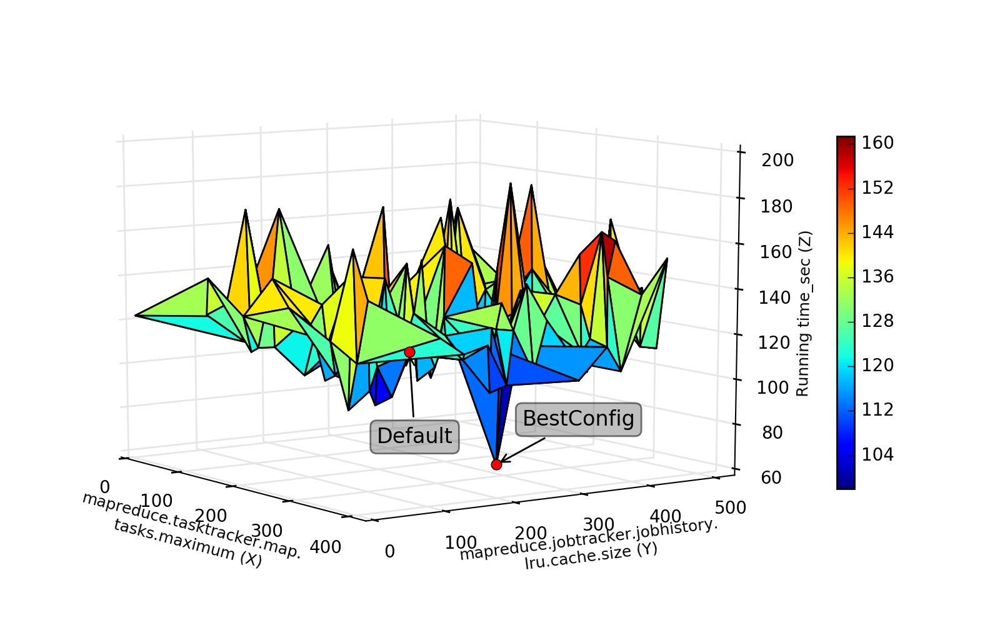

.. BestConfig documentation master file, created by
   sphinx-quickstart on Tue Nov 14 10:53:55 2017.
   You can adapt this file completely to your liking, but it should at least
   contain the root `toctree` directive.
   
BestConfig for Hadoop + Hive
===========================

Experimental Settings
---------------------

We executed Bestconfig for the Hadoop cluster with 4 nodes. The Hadoop
cluster consists of 1 master node and 3 slave nodes. All nodes used in
our experiment are shown below.

+-------------+--------+-----------------------------------------+--------+ 
|   Node      |   OS   |                   CPU                   | Memory |
+=============+========+=========================================+========+ 
|    Master   | CentOS | 16 Intel(R) Xeon(R) CPU E5620 @ 2.40GHz |  32GB  | 
+-------------+--------+-----------------------------------------+--------+ 
|    Slave 1  | CentOS | 16 Intel(R) Xeon(R) CPU E5620 @ 2.40GHz |  32GB  |
+-------------+--------+-----------------------------------------+--------+
|    Slave 2  | CentOS | 16 Intel(R) Xeon(R) CPU E5620 @ 2.40GHz |  32GB  |
+-------------+--------+-----------------------------------------+--------+ 
|    Slave 3  | CentOS | 16 Intel(R) Xeon(R) CPU E5620 @ 2.40GHz |  32GB  |
+-------------+--------+-----------------------------------------+--------+

Performance Surface
-------------------

We use `HiBench`_ that is a widely adopted benchmark tools in the
workload generator for Spark to generate the target workload. Figure 1
plot the highly differed performance surfaces for Hadoop+Hive Join
workload.

  
.. raw:: html
   
   

	The performance surface of Hadoop+Hive under Hibench-Join workload

.. raw:: html

   

Test Results
------------

.. raw:: html
	  
	  

	  
The test results of Hadoop under Join workload `hadoopJoin.arff`_. 

.. raw:: html
	  
	  

	  
The test results of Hadoop under Pagerank workload `hadoopPageRank.arff`_.

	  
.. raw:: html
	  
	  

	  
The test results of Hadoop under Join workload with 500 samples `join-trainingBestConf.arff`_ and `join-BestConfig.arff`_.

.. raw:: html
	  
	  

Interface Impl
--------------

The source files of `HadoopConfigReadin`_ and `HadoopConfigWrite`_
implement the interfaces of `ConfigReadin`_ and `ConfigWrite`_
respectively.

Download
--------

http://github.com/zhuyuqing/bestconf

.. _HiBench: https://github.com/intel-hadoop/HiBench
.. _hadoopJoin.arff: https://github.com/zhuyuqing/bestconf/blob/master/testResults/hive/hadoopJoin.arff
.. _hadoopPageRank.arff: https://github.com/zhuyuqing/bestconf/blob/master/testResults/hive/hadoopPageRank.arff
.. _join-trainingBestConf.arff: https://github.com/zhuyuqing/bestconf/blob/master/testResults/hive/500/join-trainingBestConf0_RRS0(6).arff
.. _join-BestConfig.arff: https://github.com/zhuyuqing/bestconf/blob/master/testResults/hive/500/join-trainingBestConf_RRS_0_0_150.0.arff
.. _HadoopConfigReadin: https://github.com/zhuyuqing/bestconf/blob/master/src/BI/cn/ict/zyq/bestConf/cluster/InterfaceImpl/HadoopConfigReadin.java
.. _HadoopConfigWrite: https://github.com/zhuyuqing/bestconf/blob/master/src/BI/cn/ict/zyq/bestConf/cluster/InterfaceImpl/HadoopConfigWrite.java
.. _ConfigReadin: https://github.com/zhuyuqing/bestconf/blob/master/src/main/cn/ict/zyq/bestConf/cluster/Interface/ConfigReadin.java
.. _ConfigWrite: https://github.com/zhuyuqing/bestconf/blob/master/src/main/cn/ict/zyq/bestConf/cluster/Interface/ConfigWrite.java
