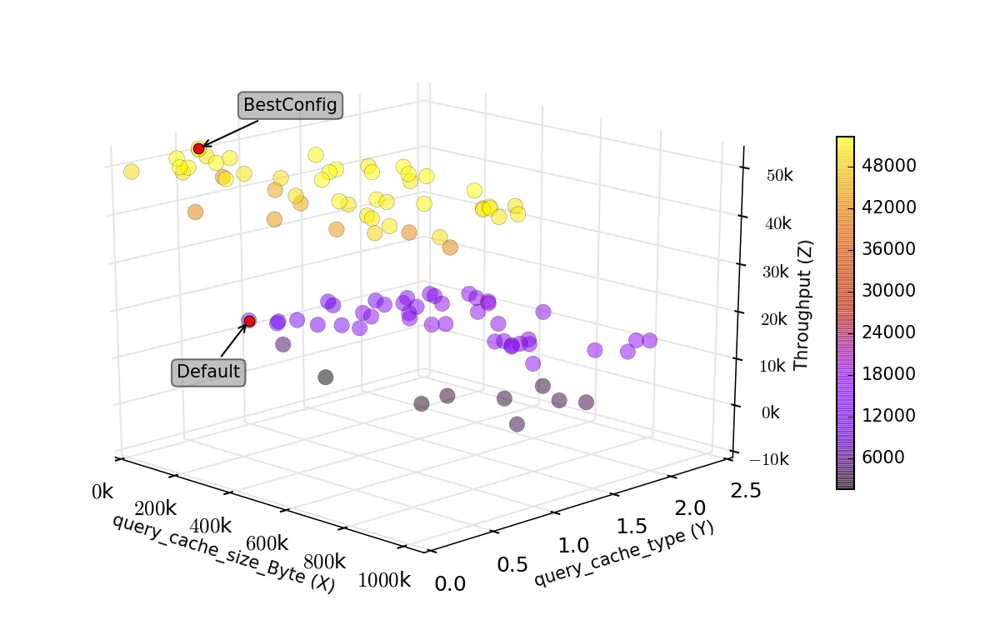

.. BestConfig documentation master file, created by
   sphinx-quickstart on Tue Nov 14 10:53:55 2017.
   You can adapt this file completely to your liking, but it should at least
   contain the root `toctree` directive.
   
BestConfig for MySQL
==================

Experimental Settings
---------------------

We executed Bestconfig for the MySQL system, and we applied sysbench to
test the performance of MySQL. All nodes used in our experiment are
shown below.

+-------------+--------+-----------------------------------------+--------+ 
|   Node      |   OS   |                   CPU                   | Memory |
+=============+========+=========================================+========+ 
|    MySQL    | CentOS | 16 Intel(R) Xeon(R) CPU E5620 @ 2.40GHz |  32GB  | 
+-------------+--------+-----------------------------------------+--------+ 
|  Sysbench   | CentOS | 16 Intel(R) Xeon(R) CPU E5620 @ 2.40GHz |  32GB  |
+-------------+--------+-----------------------------------------+--------+

Performance Surface
-------------------

We use `Sysbench`_ that is a widely adopted benchmark tools in the
workload generator for MySQL to generate the target workload. Currently,
the test type in our experiment is oltp and the test mode is simple, and
we set num-threads to 16, oltp-table-size to 10000000, and max-time to
300. Figure 1 is the scatter plot of performance for MySQL under OLTP
simple test mode.

  
.. raw:: html
   
   

	The scatter plot of performance for MySQL under OLTP simple test mode

.. raw:: html

   

Test Results
------------

The result of MySQL under the zipfian read-write workload
`MySQL_zipfian_readwrite.arff`_. The result of MySQL under OLTP simple
test mode `MySQL_OLTP_simple.arff`_.

Interface Impl
--------------

The source files of `MySQLConfigReadin`_ and `MySQLConfigWrite`_
implement the interfaces of `ConfigReadin`_ and `ConfigWrite`_
respectively.

Download
--------

http://github.com/zhuyuqing/bestconf

.. _Sysbench: https://github.com/nuodb/sysbench
.. _MySQL_zipfian_readwrite.arff: https://github.com/zhuyuqing/bestconf/edit/master/testResults/mysql/MySQL_zipfian_readwrite.arff
.. _MySQL_OLTP_simple.arff: https://github.com/zhuyuqing/bestconf/blob/master/testResults/mysql/MySQL_OLTP_simple.arff
.. _MySQLConfigReadin: https://github.com/zhuyuqing/bestconf/blob/master/src/mysql/cn/ict/zyq/bestConf/cluster/InterfaceImpl/MySQLConfigReadin.java
.. _MySQLConfigWrite: https://github.com/zhuyuqing/bestconf/blob/master/src/mysql/cn/ict/zyq/bestConf/cluster/InterfaceImpl/MySQLConfigWrite.java
.. _ConfigReadin: https://github.com/zhuyuqing/bestconf/blob/master/src/main/cn/ict/zyq/bestConf/cluster/Interface/ConfigReadin.java
.. _ConfigWrite: https://github.com/zhuyuqing/bestconf/blob/master/src/main/cn/ict/zyq/bestConf/cluster/Interface/ConfigWrite.java
