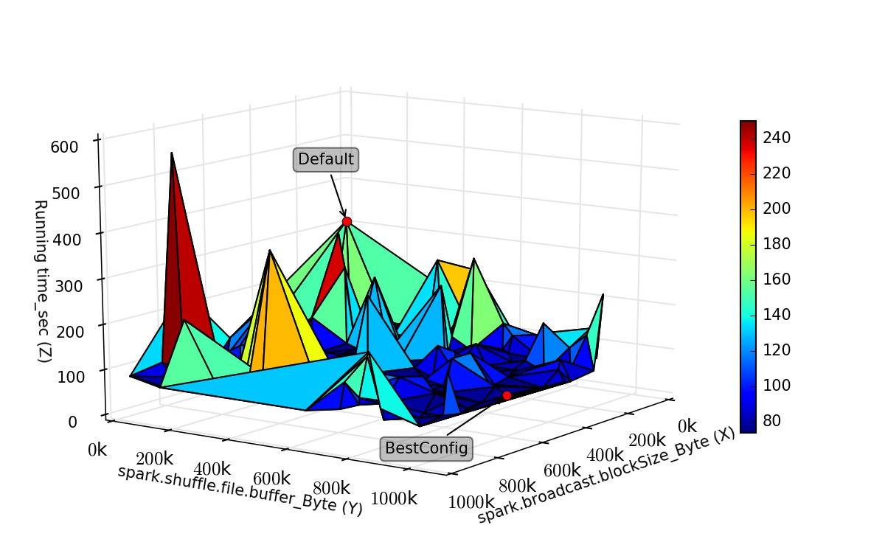

.. BestConfig documentation master file, created by
   sphinx-quickstart on Tue Nov 14 10:53:55 2017.
   You can adapt this file completely to your liking, but it should at least
   contain the root `toctree` directive.
   
BestConf for Spark
==================

Experimental Settings
---------------------

We executed Bestconf for the spark cluster with 4 nodes. The spark
cluster consists of 1 master node and 3 slave nodes. All nodes used in
our experiment are shown below.

+-------------+--------+-----------------------------------------+--------+ 
|   Node      |   OS   |                   CPU                   | Memory |
+=============+========+=========================================+========+ 
|    Master   | CentOS | 16 Intel(R) Xeon(R) CPU E5620 @ 2.40GHz |  32GB  | 
+-------------+--------+-----------------------------------------+--------+ 
|    Slave 1  | CentOS | 16 Intel(R) Xeon(R) CPU E5620 @ 2.40GHz |  32GB  |
+-------------+--------+-----------------------------------------+--------+
|    Slave 2  | CentOS | 16 Intel(R) Xeon(R) CPU E5620 @ 2.40GHz |  32GB  |
+-------------+--------+-----------------------------------------+--------+ 
|    Slave 3  | CentOS | 16 Intel(R) Xeon(R) CPU E5620 @ 2.40GHz |  32GB  |
+-------------+--------+-----------------------------------------+--------+

Performance Surface
-------------------

We use `HiBench`_ that is a widely adopted benchmark tools in the
workload generator for Spark to generate the target workload. Figure 1
plot the highly differed performance surfaces for Spark Pagerank
workload.

  
.. raw:: html
   
   

	The performance surface of Spark under Hibench-Pagerank workload

.. raw:: html

   

Test Results
------------

The test result of Spark pagerank workload `pagerank`_. The test result
of Spark kmeans workload `kmeans`_.

Interface Impl
--------------

The source files of `SparkConfigReadin`_ and `SparkConfigWrite`_
implement the interfaces of `ConfigReadin`_ and `ConfigWrite`_
respectively.

Download
--------

http://github.com/zhuyuqing/bestconf

.. _HiBench: https://github.com/intel-hadoop/HiBench
.. _pagerank: https://github.com/zhuyuqing/bestconf/blob/master/testResults/spark/pagerank00.arff
.. _kmeans: https://github.com/zhuyuqing/bestconf/blob/master/testResults/spark/kmeans-trainingBestConf_RRS_0_0_262.0.arff
.. _SparkConfigReadin: https://github.com/zhuyuqing/bestconf/blob/master/src/spark/cn/ict/zyq/bestConf/cluster/InterfaceImpl/SparkConfigReadin.java
.. _SparkConfigWrite: https://github.com/zhuyuqing/bestconf/blob/master/src/spark/cn/ict/zyq/bestConf/cluster/InterfaceImpl/SparkConfigWrite.java
.. _ConfigReadin: https://github.com/zhuyuqing/bestconf/blob/master/src/main/cn/ict/zyq/bestConf/cluster/Interface/ConfigReadin.java
.. _ConfigWrite: https://github.com/zhuyuqing/bestconf/blob/master/src/main/cn/ict/zyq/bestConf/cluster/Interface/ConfigWrite.java