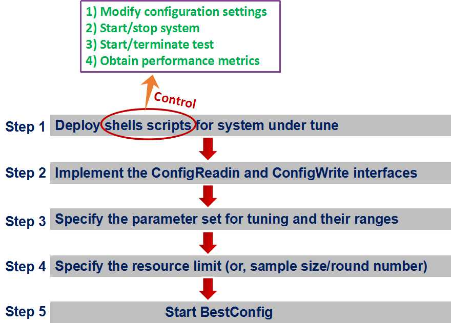
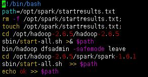
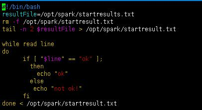
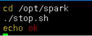
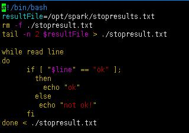
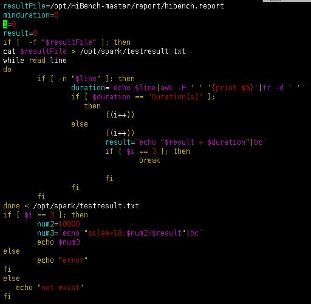
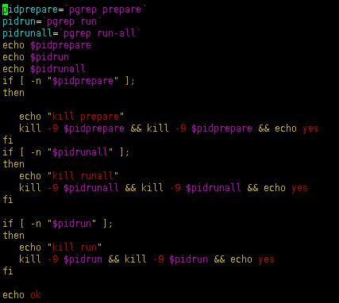
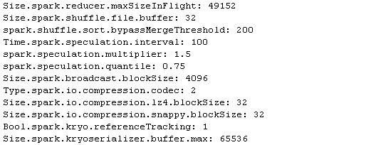
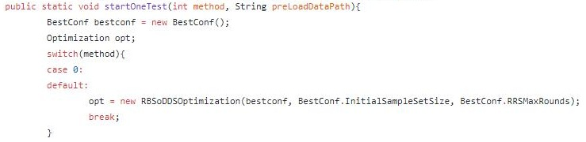

.. toctree::
   :maxdepth: 2
   :numbered: 2

QuickStart
===========

Good tools make system performance tuning quicker, easier and cheaper
than if everything is done manually or by experience.

Bestconfig can find better configurations for a specific large-scale
system deployed for a given application workload.

-  `Overview`_\ 
-  `BestConfig Tuning – Taking Spark as the example SUT`_\ 
-  `Implementing your own sampling/tuing algorithms for BestConfig`_\ 

.. raw:: html

   

Overview
---------

.. raw:: html

   

.. image:: ../pics/BestConfig.png
  
.. raw:: html

   

	Deployment architecture

.. raw:: html

   

Here, “deployment environment” refers to the actual running environment
of your applications, while “staging environment” is some environment
that is almost the same as the deployment environment but where tests
are run without interfering the actual application.

.. raw:: html

   

     The process of deploying BestConfig

.. raw:: html

   

The detailed method of using BestConfig to tune practical system is as
the following, which can be showed by a case of spark tuning.

.. raw:: html

   

BestConfig Tuning – Taking Spark as the example SUT
------------------------------------------------------

.. raw:: html

   

Step 1. Deploy shells scripts for system under tune
+++++++++++++++++++++++++++++++++++++++++++++++++++++

There are 9 shell scripts in BestConfig and they are classified into two
groups.

.. raw:: html

   

1. One group consists of 5 shell scripts. They are start.sh, isStart.sh,
   stop.sh, isClosed.sh and terminateSystem.sh and deployed on the
   system under tune.

   .. raw:: html

      

   .. raw:: html

      

   .. raw:: html

      

	  
.. raw:: html
	  
	  

	  
.. image:: ../pics/shells-tune.jpg

.. raw:: html
	  
	  

	  
    The scripts of start.sh and stop.sh deployed on worker and master
   node are different.

.. raw:: html

      

   (1) Shell scripts (start.sh and stop.sh) on master node

.. raw:: html

          

.. raw:: html
	  
	  

	  

.. raw:: html
	  
	  

.. raw:: html

          

       start.sh(master) – this script will start the system on the
       master node

.. raw:: html

          

.. raw:: html

          

.. raw:: html

          

		 
.. raw:: html
	  
	  

	  
.. image:: ../pics/stop.jpg

.. raw:: html
	  
	  

.. raw:: html
          
		  

       stop.sh(master) – this script will stop the system on the master
       node

.. raw:: html

          

.. raw:: html

          

   (2) Shell scripts (start.sh and stop.sh) on worker node

.. raw:: html

          

		  
.. raw:: html
	  
	  

	  
.. image:: ../pics/start_worker.jpg

.. raw:: html
	  
	  

.. raw:: html

    

       start.sh(worker) – this script will start the system on the worker node

.. raw:: html

          

.. raw:: html

          

.. raw:: html

          

		  
.. raw:: html
	  
	  

	  

.. raw:: html
	  
	  

.. raw:: html
          
		  

       stop.sh(worker) – this script will stop the system on the worker node

.. raw:: html

          

.. raw:: html

          

		  
(3) Identical shell scripts on master and worker node

    .. raw:: html

       

    .. raw:: html

       

    .. raw:: html

       

.. raw:: html
	  
	  

	  

.. raw:: html
	  
	  

.. raw:: html

       

    isStart.sh – this script will return OK if the system is
    successfully started

.. raw:: html

       

.. raw:: html

       

.. raw:: html

       

	   
.. raw:: html
	  
	  

	  

.. raw:: html
	  
	  

.. raw:: html

       

	   
    terminateSystem.sh – this script will terminate the system process
    on the server

.. raw:: html

       

.. raw:: html

       

.. raw:: html

       

.. raw:: html
	  
	  

	  

.. raw:: html
	  
	  

    
.. raw:: html

       

    isClosed.sh – this script will return OK if the system is
    successfully terminated

.. raw:: html

       

2. The other group consists of 4 shell scripts. They are startTest.sh,
   getTestResult.sh, terminateTest.sh and isFinished.sh and deployed on
   the test node.

   .. raw:: html

      

   .. raw:: html

      

   .. raw:: html

      

   .. raw:: html

      

	  
.. raw:: html
	  
	  

	  
.. image:: ../pics/shell-test.jpg

.. raw:: html
      
	  

.. raw:: html
	  
	  

	  

.. raw:: html
	  
	  

	  
.. raw:: html

      

   startTest.sh – this script will start a test towards the system under
   tune

.. raw:: html

      

.. raw:: html

      

.. raw:: html

      

	  

.. raw:: html

      

   isFinished.sh – this script will return OK if the test is done

.. raw:: html

      

.. raw:: html

      

.. raw:: html

      

.. raw:: html
	  
	  

	  

.. raw:: html
	  
	  

.. raw:: html

      
	  

   getTestResult.sh – this script will return performance metrics
   regarding the test

.. raw:: html

      

.. raw:: html

      

.. raw:: html

      

.. raw:: html
	  
	  

	  

.. raw:: html
	  
	  

.. raw:: html

      

   terminateTest.sh – this script will terminate the testing process

.. raw:: html

      

Step 2. Implement the ConfigReadin and ConfigWrite interfaces
++++++++++++++++++++++++++++++++++++++++++++++++++++++++++++++++++

As for spark tuning, we need to implement the ConfigReadin and
ConfigWrite interfaces as `SparkConfigReadin`_ and `SparkConfigWrite`_.

Next, we need to compile SparkConfigReadin and SparkconfigWrite to
bytecodes. Then the location(path) of compiled bytecodes need to be added to classpath of BestConfig project.

.. _SparkConfigReadin: https://github.com/zhuyuqing/bestconf/blob/master/src/spark/cn/ict/zyq/bestConf/cluster/InterfaceImpl/SparkConfigReadin.java
.. _SparkConfigWrite: https://github.com/zhuyuqing/bestconf/blob/master/src/spark/cn/ict/zyq/bestConf/cluster/InterfaceImpl/SparkConfigWrite.java

.. raw:: html
	  
	  

	  
.. image:: ../pics/interface1.jpg

.. raw:: html
	  
	  

.. raw:: html
	  
	  

	  

.. raw:: html
	  
	  

.. raw:: html
	  
	  

	  
.. image:: ../pics/interface3.jpg

.. raw:: html
	  
	  

Step 3. Specify the parameter set for tuning and their ranges
+++++++++++++++++++++++++++++++++++++++++++++++++++++++++++++++

.. raw:: html

   

(1) An example of defaultConfig.yaml (specifying the parameters for
    tuning)

.. raw:: html

       

.. raw:: html

       

	
.. raw:: html

       

.. raw:: html

       

    (2) An example of defaultConfig.yaml_range (the valid ranges of
        parameters) 

.. raw:: html

           

.. raw:: html

       

	
.. image:: ../pics/defaultConfig_range.jpg
    
.. raw:: html

       

Step 4. Specify the resource limit and things about the tuning environment (or, sample size/round number)
++++++++++++++++++++++++++++++++++++++++++++++++++++++++++++++++++++++++++++++++++++++++++++++++++++++++++++++

.. raw:: html

   

(1) bestconf.properties

.. raw:: html

       

.. raw:: html

       

	

    
.. raw:: html

       

.. raw:: html

   

(2) SUTconfig.properties 

.. raw:: html

       

.. raw:: html

       

	
.. image:: ../pics/SUTconfig_propertiesNew3.jpg
    
.. raw:: html

       

Step 5. Start BestConfig
++++++++++++++++++++++++++

Now, you can start BestConfig. BestConfig will automatically run the
tuning process without any requirement for user interferences, until the
tuning process ends due to resource exhaustion or unhandlable
environment errors.

BestConfig will output the best configuration setting into files once
the tuning is done.

.. raw:: html

 

  You can start bestconfig with the help of ant. The detailed instructions are as follows. 
  
.. raw:: html

      

(1). cd bestconf-maste

.. raw:: html

 

  (2). ant compile
  
.. raw:: html

 

(3). ant run  

.. raw:: html

   

Implementing your own sampling/tuing algorithms for BestConfig
---------------------------------------------------------------

.. raw:: html

   

You can also choose to extend and tailor BestConfig for your specific
use cases using your own sampling/tuning algorithms.

.. raw:: html

       

.. raw:: html

       

	   
1. To implement your own sampling algorithms       –> Extend the
    abstract class of ConfigSampler

.. raw:: html

       

.. image:: ../pics/ConfigSampler1.jpg

.. raw:: html

       

.. raw:: html

       

.. image:: ../pics/ConfigSampler2.jpg

.. raw:: html

       

2. To implement your own tuning algorithms       –> Implement the
    interface of Optimization

.. raw:: html

       

.. image:: ../pics/Optimization1.jpg

.. raw:: html

       
 
	   
.. raw:: html

       

.. image:: ../pics/Optimization2.jpg

.. raw:: html

       
 

.. raw:: html

       

.. image:: ../pics/Optimization3.jpg

.. raw:: html

       
 

.. raw:: html

       

.. raw:: html

       

